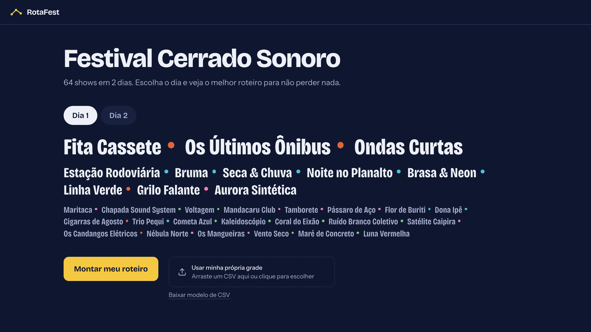
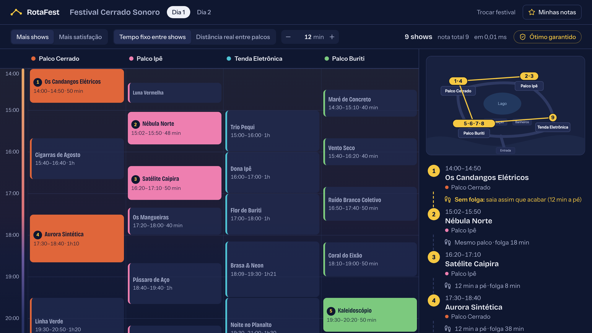
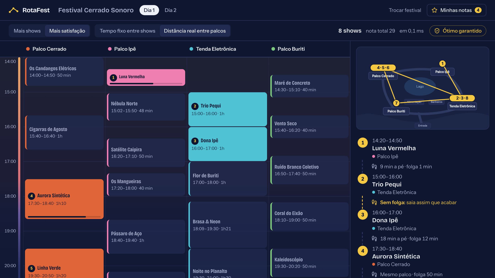
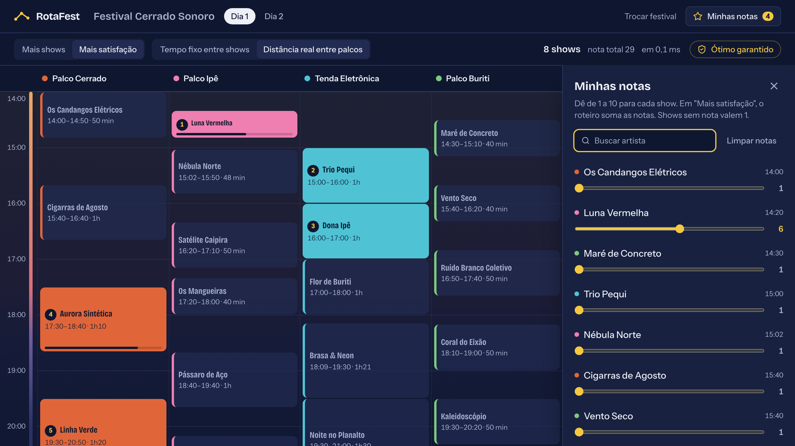
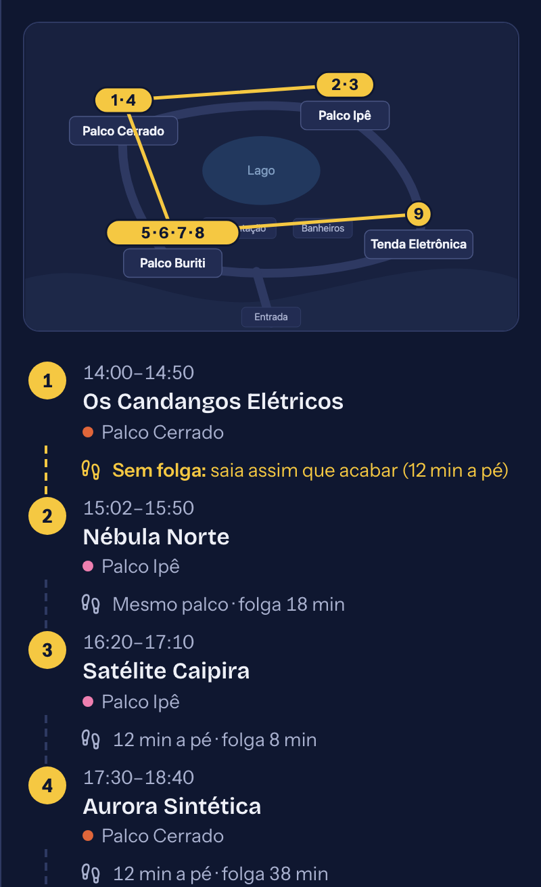
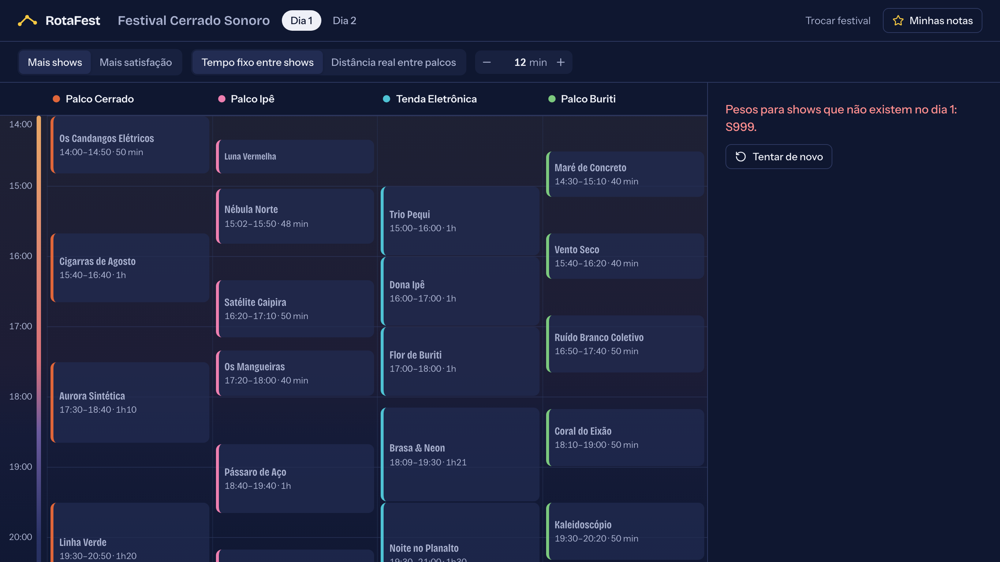

# RotaFest

**Conteúdo da Disciplina:** Greed (Algoritmos Ambiciosos)<br>

## Alunos

| Foto | Nome | Matrícula |
| :---: | :--- | ---: |
|  | **Gabriel Lima** | 222037610 |
|  | **Mateus Bastos** | 211062240 |

---

## Sobre

**RotaFest** é um planejador de roteiro para festivais de música que resolve um problema que todo frequentador conhece: em um festival com vários palcos simultâneos, é impossível assistir a tudo. Dois shows que você quer ver começam no mesmo horário, e ainda existe o tempo de caminhada entre um palco e outro.

O projeto modela a grade do festival como um **conjunto de intervalos** (cada show é um intervalo com horário de início, horário de término e palco de origem) e aplica algoritmos ambiciosos para responder a três perguntas distintas:

1. **Qual o maior número de shows que consigo assistir por completo?**
   Resolvido por *Interval Scheduling* guloso, com garantia de otimalidade.

2. **Qual o roteiro que maximiza minha satisfação, e não apenas a quantidade?**
   Cada show recebe uma nota de preferência de 1 a 10. Aqui o guloso **deixa de ser ótimo**, e a solução correta exige *Weighted Interval Scheduling* por programação dinâmica. O confronto entre os dois é o núcleo analítico do trabalho.

3. **Quantos palcos, no mínimo, o festival precisaria para acomodar toda a grade?**
   Resolvido por *Interval Partitioning* com fila de prioridade, comparando o resultado com o número de palcos que o festival efetivamente utilizou.

### O diferencial: custo de deslocamento

A modelagem ingênua trata dois shows como compatíveis sempre que um termina antes do outro começar. Isso é falso no mundo real: se o próximo show está em um palco a doze minutos de caminhada, o intervalo efetivamente ocupado é maior do que a duração do show.

O RotaFest trata o deslocamento de dois modos, e a diferença entre eles é o centro da análise:

- **Modo uniforme:** um tempo constante `δ` separa quaisquer dois shows consecutivos. O término de cada show é inflado para `fim + δ` e o guloso roda sobre os intervalos transformados. Como `δ` é constante, a transformação preserva a ordem dos términos e o guloso **permanece comprovadamente ótimo**.
- **Modo matricial:** o custo depende do par de palcos, lido de uma matriz de distâncias. Aqui a compatibilidade deixa de ser uma relação entre intervalos na reta e o argumento de troca **deixa de valer**: o guloso pode errar. A solução exata passa a ser um **caminho de peso máximo em um DAG** de shows, em `O(n²)`.

Mostrar onde o guloso deixa de ser ótimo, em vez de aplicá-lo fora das suas hipóteses, é parte do trabalho. Toda resposta da aplicação informa se o resultado tem otimalidade garantida. As demonstrações formais estão em [`docs/provas_formais.md`](./docs/provas_formais.md).

### Público e aplicação

A saída é uma grade visual no formato que o público já conhece dos aplicativos oficiais de festival, com os shows selecionados em destaque e os descartados em cinza, mais uma rota desenhada sobre o mapa do evento. O objetivo é tornar o comportamento do algoritmo **legível para quem não conhece o algoritmo**.

---

## Funcionalidades e Algoritmos

### Algoritmos implementados

| # | Algoritmo | Estratégia | Complexidade | Ótimo? |
|:-:|---|---|:-:|:-:|
| 1 | **Interval Scheduling** | Guloso por menor horário de término | O(n log n) | Sim |
| 2 | **Weighted Interval Scheduling** | Programação dinâmica com busca binária | O(n log n) | Sim |
| 3 | **Interval Partitioning** | Guloso por horário de início com min-heap | O(n log n) | Sim |
| 4 | **Caminho máximo em DAG** | Programação dinâmica em ordem topológica (modo matricial) | O(n²) | Sim |
| 5 | **Heurísticas de comparação** | FIFO, SPT e maior preferência | O(n log n) | Não |

#### 1. Interval Scheduling (maximização de quantidade)

Ordena os shows pelo horário de término e seleciona iterativamente o primeiro compatível com o último escolhido. A otimalidade é demonstrada por **argumento de troca**: qualquer solução ótima pode ser transformada na solução gulosa sem redução de cardinalidade.

#### 2. Weighted Interval Scheduling (maximização de satisfação)

Com pesos, o guloso falha. O projeto inclui um **contraexemplo mínimo explícito**, em que um show de peso alto e longa duração é descartado pelo guloso em favor de dois shows curtos de peso baixo. A solução exata usa a recorrência `OPT(j) = max(peso[j] + OPT(p(j)), OPT(j-1))`, onde `p(j)` é o último show compatível com `j`, localizado por busca binária.

#### 3. Interval Partitioning (dimensionamento de palcos)

Processa os shows por horário de início mantendo um min-heap dos horários de liberação de cada palco. O **limite inferior** é a profundidade máxima de sobreposição da grade, e o guloso nunca ultrapassa esse limite, o que fecha a prova de otimalidade em poucas linhas.

#### 4. Caminho máximo em DAG (deslocamento matricial)

Cada show é um vértice, com aresta `i → j` quando dá tempo de sair de `i` e chegar a `j` considerando a distância real entre os palcos. O grafo é acíclico porque as arestas apontam sempre para shows que começam depois, e o roteiro ótimo é o caminho de maior peso.

#### 5. Heurísticas de comparação

Implementadas exclusivamente para contraste empírico:

- **FIFO** (*First In, First Out*): seleciona por ordem de início.
- **SPT** (*Shortest Processing Time*): seleciona por menor duração.
- **Maior preferência**: seleciona pela maior nota, ignorando conflitos futuros.

### Funcionalidades da aplicação

- [x] Leitura da grade do festival via CSV, com validação por linha e coluna
- [ ] Importação de CSV próprio pela interface
- [ ] Atribuição de nota de preferência de 1 a 10 por show
- [ ] Grade visual por palco e faixa horária, com selecionados e descartados
- [ ] Deslocamento uniforme (`δ`) e matricial (distância entre palcos)
- [ ] Timeline com horários, custo de deslocamento e folga entre shows
- [ ] Rota sobre o mapa do festival com marcadores numerados
- [ ] Indicador de otimalidade garantida em todo resultado
- [ ] Painel comparativo entre o guloso, as soluções exatas e as heurísticas
- [ ] Gráfico de sobreposição por faixa horária, evidenciando o pico que define o número mínimo de palcos
- [ ] Verificador por força bruta para instâncias com até 20 shows
- [ ] Gerador de instâncias sintéticas para teste de desempenho

---

## Tecnologias Utilizadas

### Frontend

| Tecnologia | Uso |
|---|---|
| **React 19** | Construção da interface |
| **TypeScript** | Tipagem estática dos modelos de intervalo |
| **Vite** | Bundler e servidor de desenvolvimento |
| **Tailwind CSS 4** | Estilização da grade e dos componentes |
| **React Router** | Navegação entre as telas |
| **SVG** | Mapa estático do festival com a rota sobreposta por coordenadas relativas |

### Backend

| Tecnologia | Uso |
|---|---|
| **Python 3.12** | Linguagem dos algoritmos |
| **uv** | Gerenciamento do Python, do ambiente virtual e das dependências |
| **FastAPI** | API REST que expõe os endpoints de cálculo |
| **Pydantic** | Validação dos payloads de entrada |
| **heapq** | Fila de prioridade do Interval Partitioning |
| **pytest** | Testes unitários e verificação contra força bruta |
| **Uvicorn** | Servidor ASGI |

### Infraestrutura

| Tecnologia | Uso |
|---|---|
| **Docker** e **Docker Compose** | Execução de backend e frontend com um único comando |

---

## Estrutura do Projeto

```
G55_Greedy_PA-26.2/
├── backend/
│   ├── app/
│   │   ├── algorithms/     # algoritmos (um arquivo por algoritmo)
│   │   ├── models/         # Show, Palco, MatrizDeslocamento e schemas da API
│   │   ├── services/       # loader do CSV e comparador de estratégias
│   │   ├── routers/        # endpoints FastAPI
│   │   ├── data/           # festivais: grade_festival.csv, palcos.json, mapa
│   │   └── main.py
│   ├── tests/
│   ├── scripts/            # validação de dados, gerador de instâncias, relatórios
│   ├── Dockerfile
│   ├── pyproject.toml
│   └── requirements.txt
├── frontend/
│   ├── src/
│   │   ├── components/
│   │   ├── pages/
│   │   ├── services/api.ts
│   │   ├── types/index.ts
│   │   └── utils/tempo.ts
│   ├── Dockerfile
│   ├── package.json
│   └── vite.config.ts
├── docs/
│   ├── provas_formais.md
│   ├── analise_experimental.md
│   └── dados/              # dados brutos que sustentam a análise experimental
├── docker-compose.yml
└── README.md
```

---

## Instalação e Execução

### 1. Clonando o Repositório

```bash
git clone https://github.com/projeto-de-algoritmos-2026/G55_Greedy_PA-26.2.git
cd G55_Greedy_PA-26.2
```

### 2. Rodando com Docker (recomendado)

Pré-requisito: [Docker Desktop](https://www.docker.com/products/docker-desktop/), ou Docker Engine com o plugin Compose v2.

```bash
docker compose up --build
```

O primeiro build leva alguns minutos; os seguintes usam cache. Quando os dois serviços estiverem no ar:

| Endereço | Conteúdo |
|---|---|
| `http://localhost:5173` | Interface do RotaFest |
| `http://localhost:8000/docs` | Documentação interativa da API |

Para parar, use `Ctrl+C` ou, em outro terminal, `docker compose down`.

O código é montado dentro dos containers, então alterações no backend e no frontend recarregam sozinhas. Depois de mudar dependências (`pyproject.toml` ou `package.json`), recrie as imagens com `docker compose up --build --renew-anon-volumes`.

**Testes e scripts dentro do container:**

```bash
# Suíte completa de testes, incluindo a verificação contra força bruta
docker compose run --rm backend uv run pytest

# Validação dos dados do festival de exemplo
docker compose run --rm backend uv run python scripts/validar_dados.py festival-exemplo

# Relatório do guloso contra a solução exata no deslocamento matricial
docker compose run --rm backend uv run python scripts/relatorio_modo_b.py
```

### 3. Rodando sem Docker

Pré-requisitos: [uv](https://docs.astral.sh/uv/), que instala o Python 3.12 automaticamente, e Node.js 20.19 ou superior.

**Backend**, em um terminal:

```bash
cd backend
uv sync
uv run uvicorn app.main:app --reload --port 8000
```

**Frontend**, em outro terminal:

```bash
cd frontend
npm install
npm run dev
```

Os endereços são os mesmos da tabela acima. Em desenvolvimento, as chamadas do frontend para `/api` são encaminhadas ao backend pelo proxy do Vite.

Sem uv, com Python 3.11 ou superior já instalado, o backend também roda com pip:

```bash
cd backend
python -m venv .venv
source .venv/bin/activate        # Windows: .venv\Scripts\activate
pip install -r requirements.txt
uvicorn app.main:app --reload --port 8000
```

**Testes do frontend**, a partir de `frontend/`:

```bash
npm run test        # utilitários, incluindo o contraste mínimo de 4,5:1 da paleta
npx playwright install chromium   # só na primeira vez
npm run capturas    # com a aplicação no ar: capturas em docs/img e verificações de usabilidade
```

**Testes e scripts sem Docker**, a partir de `backend/`:

```bash
uv run pytest
uv run python scripts/validar_dados.py festival-exemplo
uv run python scripts/relatorio_modo_b.py
```

A suíte inclui a comparação dos algoritmos exatos com a enumeração exaustiva de todos os roteiros em 500 instâncias aleatórias, que é a evidência empírica da corretude.

---

## Uso

1. Acesse `http://localhost:5173` com o backend em execução.
2. Selecione o festival na lista ou carregue sua própria grade em CSV.
3. Ajuste a **nota de preferência** de cada show no painel lateral, de 1 a 10. Shows sem nota recebem peso neutro.
4. Escolha o **modo de deslocamento**: uniforme (um tempo `δ` fixo entre shows) ou matricial (distância real entre palcos).
5. Escolha o modo de otimização:
   - **Máximo de shows**: Interval Scheduling guloso (modo uniforme) ou caminho máximo em DAG (modo matricial).
   - **Máxima satisfação**: Weighted Interval Scheduling por programação dinâmica (modo uniforme) ou caminho máximo em DAG (modo matricial).
6. Clique em **"Gerar Roteiro"**. A aplicação irá:
   - Executar o algoritmo adequado ao modo escolhido e indicar se o resultado tem otimalidade garantida.
   - Gerar a timeline com os horários, o custo de cada deslocamento e a folga até o próximo show.
   - Desenhar a rota contínua no mapa com marcadores numerados.
7. Use a aba **"Dimensionamento"** para executar o Interval Partitioning e visualizar o número mínimo de palcos ao lado do gráfico de sobreposição por faixa horária.
8. Use a aba **"Comparativo"** para comparar o guloso e as soluções exatas contra FIFO, SPT e maior preferência.

### API

Todas as rotas ficam sob `/api` e estão documentadas, com exemplos executáveis, em `http://localhost:8000/docs`.

| Método e rota | O que responde |
|---|---|
| `GET /festivais` | Festivais disponíveis, com número de dias e de shows |
| `GET /festivais/{id}/grade?dia=1` | Palcos e shows de um dia |
| `GET /festivais/{id}/mapa` | Mapa do festival em SVG |
| `POST /festivais/importar` | Importa uma grade própria em CSV (fica só em memória) |
| `POST /roteiro/maximo-shows` | Roteiro com mais shows assistidos por completo |
| `POST /roteiro/maxima-satisfacao` | Roteiro com a maior soma de notas de preferência |
| `POST /dimensionamento` | Número mínimo de palcos, alocação e sobreposição por horário |
| `POST /comparativo` | Guloso, solução exata e heurísticas lado a lado, com a perda de cada heurística |
| `POST /validar` | Algoritmos contra força bruta em até 20 shows |

As rotas `POST` de cálculo recebem o mesmo corpo:

```json
{
  "festival_id": "festival-exemplo",
  "dia": 1,
  "modo_deslocamento": "matricial",
  "delta_uniforme": 12,
  "pesos": { "S023": 10, "S013": 7 }
}
```

`modo_deslocamento` e `delta_uniforme` são opcionais e, quando omitidos, usam o padrão do festival. Shows sem peso valem 1. Toda resposta de roteiro traz `otimo_garantido`, que indica se o resultado é comprovadamente ótimo. Erros respondem com `detail` em português.

---

## Screenshots

Capturas reais em 1366×768, geradas por `npm run capturas` (Playwright) com a aplicação no ar.

| Escolha do festival e do dia | Planejador: mais shows com tempo fixo entre shows |
| :---: | :---: |
|  |  |

| Mais satisfação com distância real e notas | Notas de preferência |
| :---: | :---: |
|  |  |

| Rota no mapa e timeline | Estado de erro |
| :---: | :---: |
|  |  |

---

## Vídeo de Apresentação

<!-- AJUSTAR: inserir o link -->

[Assista à apresentação do projeto](LINK_DO_VIDEO)

---

## Referências

- KLEINBERG, Jon; TARDOS, Éva. *Algorithm Design*. Boston: Pearson, 2006. Capítulo 4: Greedy Algorithms.
- CORMEN, Thomas H. et al. *Introduction to Algorithms*. 4. ed. Cambridge: MIT Press, 2022. Capítulo 15: Greedy Algorithms.
- Material da disciplina Projeto de Algoritmos, FGA/UnB, 2026.2.

---

## Licença

Projeto acadêmico desenvolvido para a disciplina Projeto de Algoritmos da Universidade de Brasília, campus Gama.
